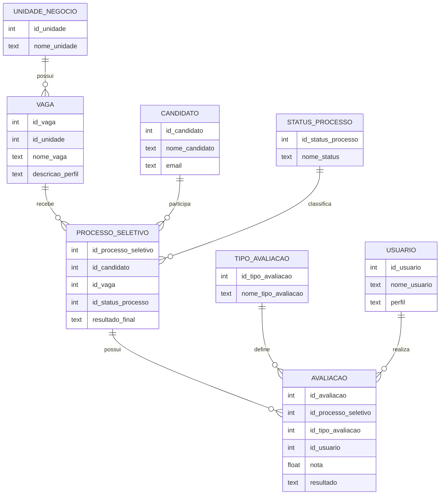

# Modelo MER - Processo Seletivo

```mermaid
erDiagram

    UNIDADE_NEGOCIO ||--o{ VAGA : possui
    VAGA ||--o{ PROCESSO_SELETIVO : recebe
    CANDIDATO ||--o{ PROCESSO_SELETIVO : participa
    STATUS_PROCESSO ||--o{ PROCESSO_SELETIVO : classifica

    PROCESSO_SELETIVO ||--o{ AVALIACAO : possui
    TIPO_AVALIACAO ||--o{ AVALIACAO : define
    USUARIO ||--o{ AVALIACAO : realiza

    UNIDADE_NEGOCIO {
        int id_unidade
        text nome_unidade
    }

    VAGA {
        int id_vaga
        int id_unidade
        text nome_vaga
        text descricao_perfil
    }

    CANDIDATO {
        int id_candidato
        text nome_candidato
        text email
    }

    PROCESSO_SELETIVO {
        int id_processo_seletivo
        int id_candidato
        int id_vaga
        int id_status_processo
        text resultado_final
    }

    STATUS_PROCESSO {
        int id_status_processo
        text nome_status
    }

    AVALIACAO {
        int id_avaliacao
        int id_processo_seletivo
        int id_tipo_avaliacao
        int id_usuario
        float nota
        text resultado
    }

    TIPO_AVALIACAO {
        int id_tipo_avaliacao
        text nome_tipo_avaliacao
    }

    USUARIO {
        int id_usuario
        text nome_usuario
        text perfil
    }

```
