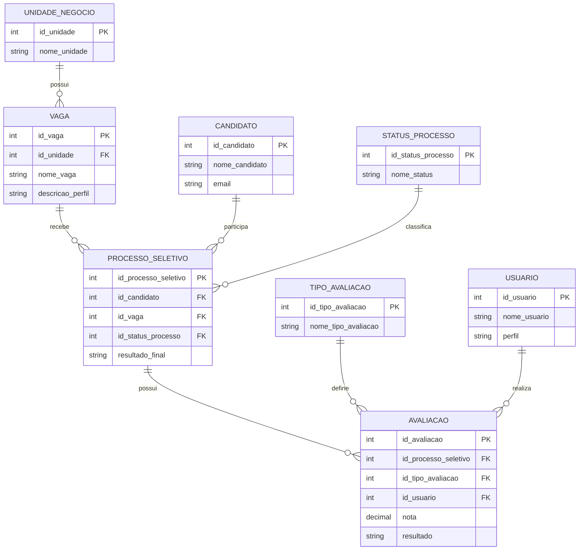

# Modelo MER - Processo Seletivo

```mermaid
erDiagram

    UNIDADE_NEGOCIO ||--o{ VAGA : possui
    VAGA ||--o{ PROCESSO_SELETIVO : recebe
    CANDIDATO ||--o{ PROCESSO_SELETIVO : participa
    STATUS_PROCESSO ||--o{ PROCESSO_SELETIVO : classifica

    PROCESSO_SELETIVO ||--o{ AVALIACAO : possui
    TIPO_AVALIACAO ||--o{ AVALIACAO : define
    USUARIO ||--o{ AVALIACAO : realiza

    UNIDADE_NEGOCIO {
        int id_unidade PK
        string nome_unidade
    }

    VAGA {
        int id_vaga PK
        int id_unidade FK
        string nome_vaga
        string descricao_perfil
    }

    CANDIDATO {
        int id_candidato PK
        string nome_candidato
        string email
    }

    PROCESSO_SELETIVO {
        int id_processo_seletivo PK
        int id_candidato FK
        int id_vaga FK
        int id_status_processo FK
        string resultado_final
    }

    STATUS_PROCESSO {
        int id_status_processo PK
        string nome_status
    }

    AVALIACAO {
        int id_avaliacao PK
        int id_processo_seletivo FK
        int id_tipo_avaliacao FK
        int id_usuario FK
        decimal nota
        string resultado
    }

    TIPO_AVALIACAO {
        int id_tipo_avaliacao PK
        string nome_tipo_avaliacao
    }

    USUARIO {
        int id_usuario PK
        string nome_usuario
        string perfil
    }
```
